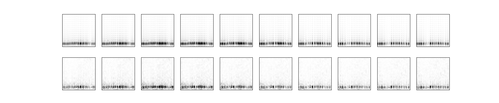
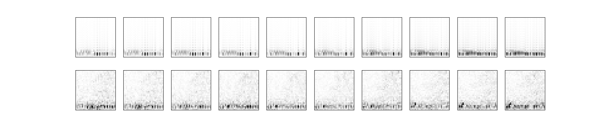
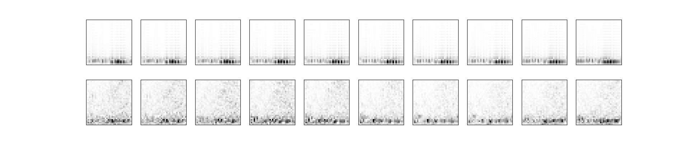
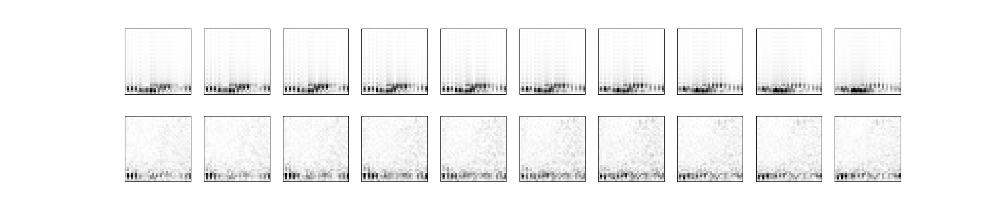
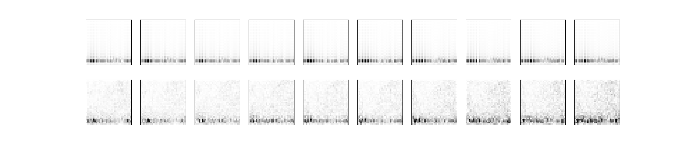
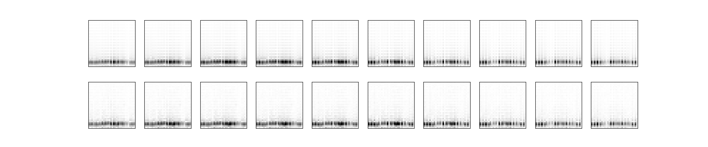
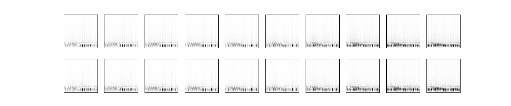
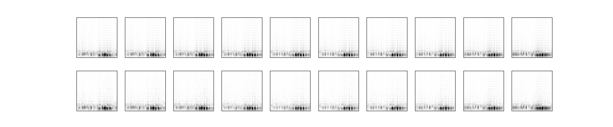
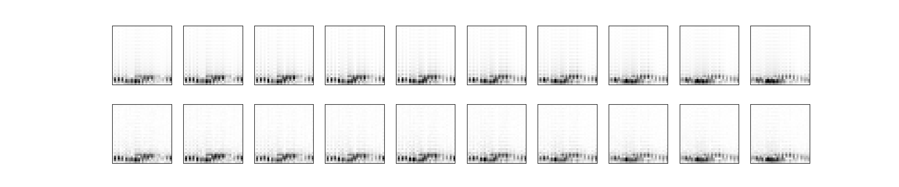
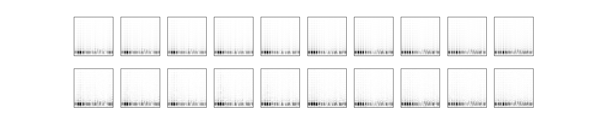

# Exercise 2.15: CSI Compression and Reconstruction using CsiNet

## Project Overview
This repository implements exercises 2.15, specifically sub-questions a, b, and c, including the training and inference evaluation programs for gen_data.m (which generates the dataset), CsiNet_train_b.py, and CsiNet_train_c.py (corresponding to sub-questions b and c, respectively).

The test results and process images can be viewed at ./result_pictures.



## Environment Setup (Windows/RTX 4050)
The project is configured for Windows 10/11 with an NVIDIA RTX 4050 GPU for hardware acceleration:
1. **Create the virtual environment with the specific Python version:**
    ```bash
    conda create -n tensorflow python=3.9.19 -y

2. **Activate the environment:**
    ```bash
    conda activate tensorflow

3. **Install CUDA Toolkit via Conda:**
    ```bash
    conda install -c conda-forge cudatoolkit=11.2 cudnn=8.1.0

4. **Install all required packages via requirements.txt:**
   ```bash
   pip install -r requirements.txt

## Implementation Details & Modifications
To complete this exercise, I performed the following technical implementations:
1. **(a) Data set generation:**
    Referencing and modifying "demo_model.m" to "gen_data.m" in GitHub: https://github.com/cost2100/cost2100/tree/master/matlab, this is used to generate a dataset in the corresponding format, assuming five different user distributions.

2. **Use datasets 1 for training, and then test using the test set of datasets 1-5:**
    Modify CsiNet_train.txt to CsiNet_train_b.py in the GitHub repository: https://github.com/le-liang/wcmlbook/tree/main/ch2/Exercise_2.15. This will be used to train the model on dataset 1 and then test it on the test sets of datasets 1-5 to observe the model's generality.

3. **Use datasets 1-5 for mixed training, and then test using the test set of datasets 1-5:**
    Modify CsiNet_train.txt to CsiNet_train_c.py in the GitHub repository: https://github.com/le-liang/wcmlbook/tree/main/ch2/Exercise_2.15. This will be used to train the model on mixed datasets 1-5, and then test it on the test set of datasets 1-5 to observe the model's improved generalization ability.

## Execution Workflow

1. Use Matlab (Matlab 2024b in this example) to execute `./cost2100-master/matlab/gen_data.m` to generate the dataset.

2. Copy the dataset from `./cost2100-master/matlab/data` to `./data`

3. Execute the 
    ```bash
    python CsiNet_train_b.py
    ```
    to train the model, perform evaluation, and obtain test images.

4. Execute the 
    ```bash
    python CsiNet_train_c.py
    ```
    to train the model, perform evaluation, and obtain test images.

## Result

1. (a):
    Different distributions are simulated by using preset configurations and changing the user's initial x and y position offsets.

2. (b):

    In sub-question b, the model was trained only on dataset1. The trained model was then tested on the test set of dataset1 and on test sets of datasets2-5, which have different user distributions. It can be observed that the model performs best (lowest NMSE) on the test set of dataset1 and is also superior to datasets2-5, demonstrating that the model's generality depends on the distribution of the training dataset.

    
    
    
    
    

3. (c):

    In sub-question c, the model is trained on a dataset consisting of a mixture of datasets 1-5. The trained model is then tested on the test sets of datasets 1-5. It can be observed that the model performs similarly on the test sets of datasets 1-5 (with similar NMSEs), further demonstrating that the model's generality depends on the distribution of the training dataset; the more diverse the distributions in the training dataset, the better the model's robustness.

    
    
    
    
    